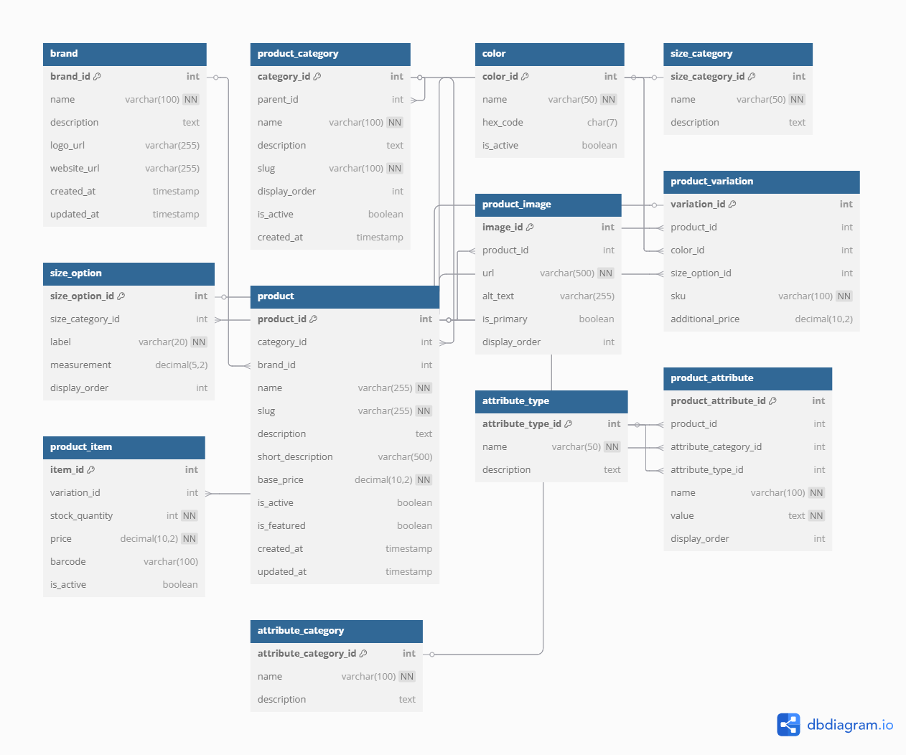

# 🛍️ E-Commerce Database System

*A comprehensive database design for online retail platforms*




## Project Overview

This database system provides the foundation for a full-featured fashion e-commerce platform. It supports:

- A flexible product catalog with variations (e.g., sizes, colors)
- Inventory and SKU tracking
- Category management with parent-child relationships
- Product media/image storage
- A dynamic product attributes system
- Brand information management


## Key Features
**Normalized relational structure** (3NF-compliant)
**Robust product variation system**
**Hierarchical categorization**
**Extensible attribute framework**
**Integrated brand and metadata support**

##  Tools Used

| Tool                        | Purpose                                     |
|-----------------------------|----------------------------------------------|
| *MySQL*                     | Primary RDBMS for schema creation & queries  |
| *dbdiagram.io*              | ERD design and relationship visualization    |
| *VS Code / MySQL Workbench* | Writing and managing SQL scripts             |
| *Git & GitHub*              | Version control                              |

---


## Database Schema

### Core Entities


| Table                | Description                          |
|----------------------|--------------------------------------|
| `brand`              | Manufacturer or brand details        |
| `product_category`   | Hierarchical product categories      |
| `product`            | Base product information             |
| `product_item`       | Inventory-level SKUs                 |


### Variation System


| Table                | Description                          |
|----------------------|--------------------------------------|
| `product_variation`  | Variants (color, size) per product   |
| `color`              | Available color options              |
| `size_category`      | Size classifications (e.g., clothing)|
| `size_option`        | Specific size values (e.g., M, L)    |


### Attribute Framework

| Table                | Description                          |
|----------------------|--------------------------------------|
| `attribute_category` | Grouping of product attributes       |
| `attribute_type`     | Attribute data types (text, number)  |
| `product_attribute`  | Assigned attributes per product      |


## 🛠️ Technical Implementation

### Requirements

- MySQL 8.0+ or PostgreSQL 13+
- Minimum 100MB storage
- UTF-8 (utf8mb4) character encoding


### Installation
```bash
# Import the schema and sample data
mysql -u [username] -p < ecommerce.sql
```


### Sample Queries
Get all products in a specific category:
```bash
SELECT p.name AS product_name, b.name AS brand_name
FROM product p
JOIN brand b ON p.brand_id = b.brand_id
WHERE p.category_id = 5;
```

Find all variations of a product:
```bash
SELECT p.name AS product_name, c.name AS color, s.label AS size
FROM product_variation pv
JOIN product p ON pv.product_id = p.product_id
LEFT JOIN color c ON pv.color_id = c.color_id
LEFT JOIN size_option s ON pv.size_option_id = s.size_option_id;
```

### Repository Structure
ecommerce-database/
├── README.md                 # Project overview and setup guide
├── database schema/
│   ├── ecommerce.sql         # Main schema: table creation + constraints
│   ├── sample_data.sql       # Sample fashion-related data
│   ├── indexes.sql           # Index creation queries for optimization
├── images/
│   └── erd.png               # Entity Relationship Diagram (ERD)


### Contributors
Chalonreay Kahindi
luckychalonreay@gmail.com
Group 286


